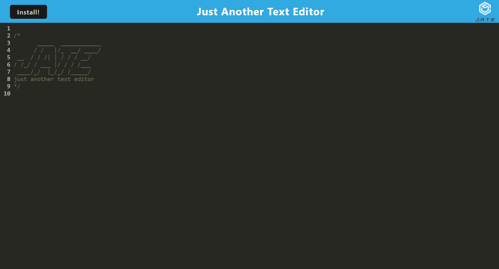
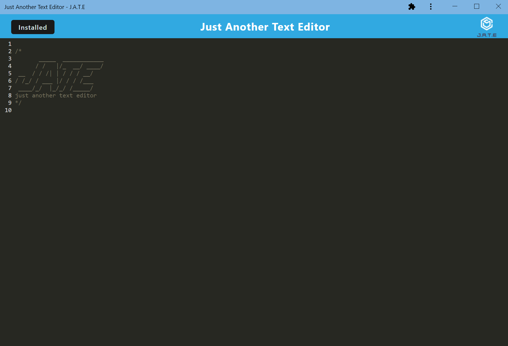

# Text Editor

## Description
This text editor application allows the user to write code on any web browser. The application can also be downloaded and installed locally so it can be used without any internet connection.

## Installation
No installation is required to use the application in the web browser. The user can install the application locally on their system by using the "install" button in the upper left corner.

## Usage
The application is incredibly simple to use! Simply start typing and away you go! The installation process is quick as well. The application is deployed using heroku: [heroku](https://nameless-journey-88318.herokuapp.com/)
 
 

 
 

